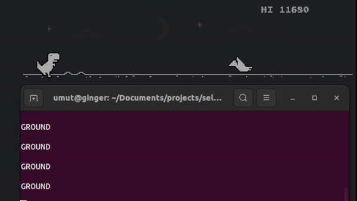

# self-playing-dino

You must have seen Google Chrome's 'Dino Game' when your internet connection goes down. It's a fun and frustrating game to improve your best score. Then I thought, maybe I could train a basic AI model to play this game on its own, so here it is!

<p align="center"></p>

## Usage

Before you can play, some packages need to be installed. However, it is required to install packages in root mode because taking screenshots and controlling keyboard keys couldn't be used without root mode.

Create virtual environment:

```
python3 -m venv dino
```
Activate the environment:
```
source dino/bin/activate
```
Install dependencies:
```
sudo pip install -r requirements.txt
```
RUN the code:
```
sudo python3 play.py
```

### To-do

- [ ] Train reinforcement model for the same task
- [ ] Add a GUI to show and customize the ROI
